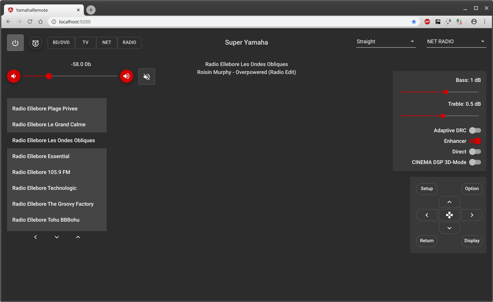

# YamahaRemote

## Overview

This is a remote control app for Yamaha receivers. It is a single page application written in Typescript / Angular for
the web browser. It features a simple material design UI.

The main aim of this project is to reproduce the functionality of the official android app (AV Controller), in order to
be able to control the receiver from a web browser interface.

The following features have been implemented yet:

- Power On/Off
- Volume control / Mute
- Playback information (song / artist / album / radio station)
- Input selection
- DSP modes selection
- Scenes selection
- Play / Pause / Next / Skip
- Web radio station selection from favourites
- Sound control (Bass / Treble / Enhancer / Adaptive DRC / Direct / CINEMA DSP 3D-Mode)
- Cursor keys, Options, Setup, Return, Display...
- Sleep Timer

## Compatibility

The app communicates with the receiver through the REST API it exposes. It has been written and tested against the
RX-V475 model, but will probably work quite well with other models of the RX-series and maybe others too. If not,
it should not be too difficult to extend it for other models. As I don't own other models and wouldn't have the
possibility to test it, I don't intend to do so. Please feel free to fork this project to make it compatible with your
receiver! You can also send me pull requests, I would be happy to review and maybe integrate them.

The app was developed for the chromium browser and also tested on firefox. Don't expect it to work on IE or older browsers.

## Coding

This project relies on the following technologies:

- Typescipt
- Angular (with CLI)
- RxJS
- NgRx Store
- Node.js NPM
- Docker
- NGINX

It was developed in the WebStorm IDE.

You can find an XML description of the REST-API of your receiver at this URL:

*http://[IP of your receiver]/YamahaRemoteControl/desc.xml*

## Development server

Edit `proxy.conf.json` and replace the URL with the URL of your receiver in your local network. Install module
dependencies with `npm install`. Run `npm start` for a dev server. Navigate to `http://localhost:4200/`. The app will
automatically reload if you change any of the source files.

## Build

Run `ng build` to build the project. The build artifacts will be stored in the `dist/` directory. Use the `-prod` flag
for a production build.

## Build docker container

Run `docker build -t angular-remote .` inside the main folder of the project.

## Start docker container

The NGINX server inside the container needs to know the IP address of your receiver. It is passed as an environment
variable to the container upon start. If the address of your receiver is http://192.168.188.80 and you want to expose
the app on port 9200, start the container like this:

`docker run -d -p 9200:80 --env BACKEND_API_URL=http://192.168.188.80 yamaha-remote`

## Start docker container from Docker Hub

master releases of YamahaRemote automatically get build at Docker Hub. You can deploy directly from Docker Hub without
having to download the sources and build the container by yourself by issuing the following command (for receiver at IP
192.168.188.80 and serving on port 9200):

`docker run -d -p 9200:80 --env BACKEND_API_URL=http://192.168.188.80 tryptophane/yamaha-remote`

Docker Hub URL: https://hub.docker.com/repository/docker/tryptophane/yamaha-remote

## TODO's

### Functionality:

- FM / AM radio control (Tuning, selecting and storing presets, switching between AM and FM, etc...)
- USB file selection
- Network discovery (suppress the need for configuring the IP address of the receiver)
- Support multiple zones
- You tell me...

### Design:

I focused on functionality and invested only little efforts in layout and design. The layout is optimized for the HiDPI
screen of my notebook. There is some work to do to make it compatible with lower resolution screens and mobile devices
like tablets or smartphones.

### Coding:

- Architecure improvements (make it easier to extend to other receiver models)
- Tests (karma /E2E) *little motivation to write tests in my free time...*

## Want to help?

Use Github to report bugs or send pull requests. I'm doing this in my free time and have lots of other hobbies, so there
is no guarantee that I will reply, fix bugs or review / merge your pull requests. But maybe I'll try :-)

## Screenshots

